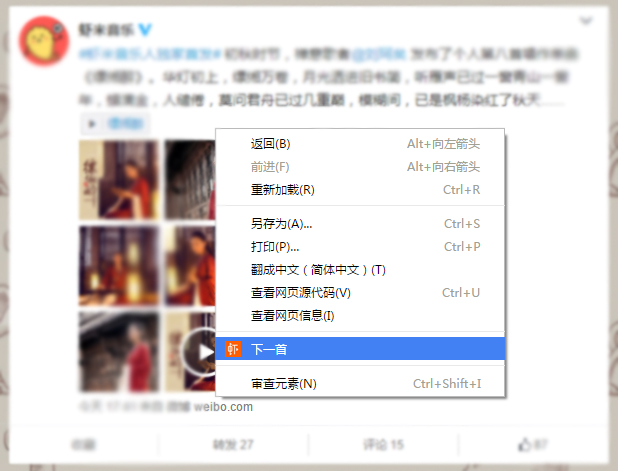
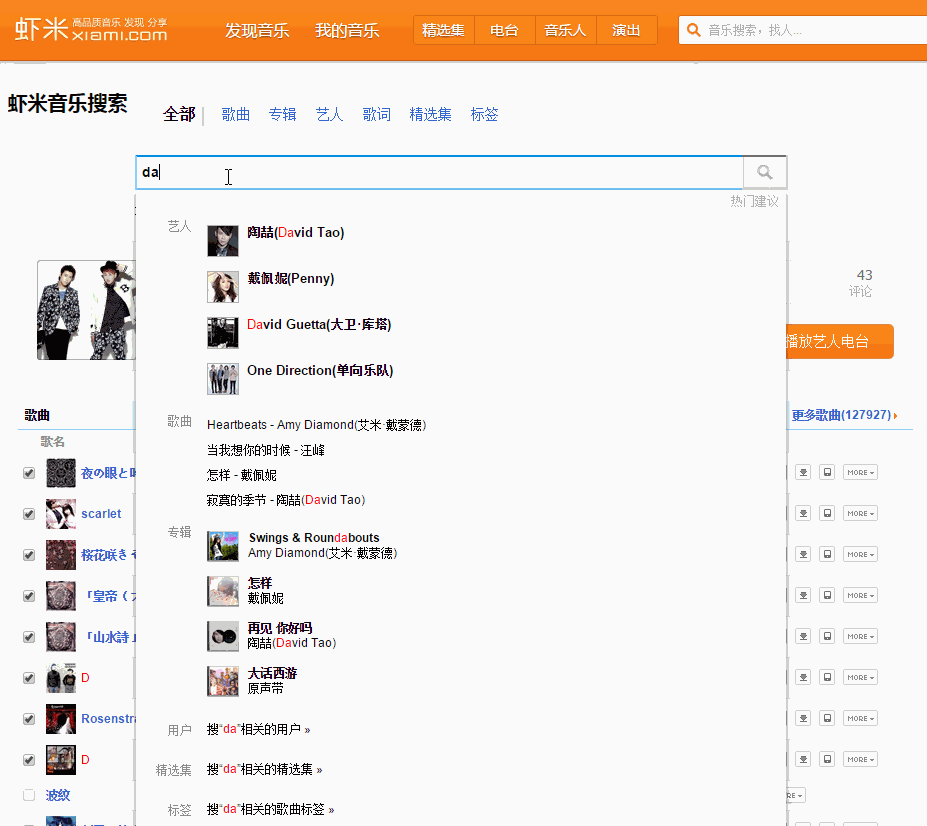
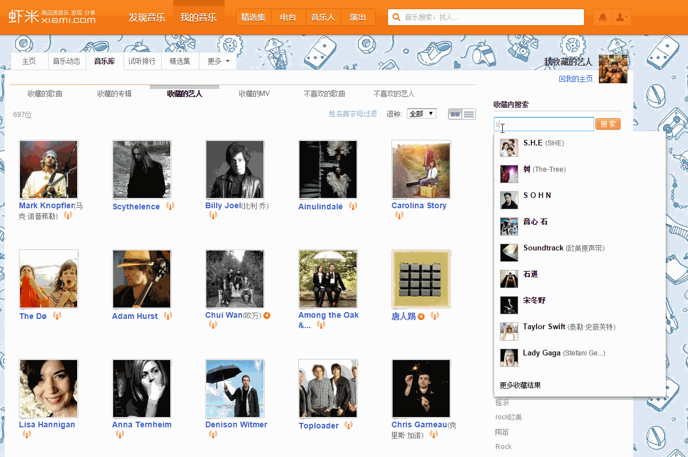

# 虾米小助手浏览器插件
针对虾米网(xiami.com)做各种功能体验优化扩展

##安装：
支持谷歌Chrome浏览器，360安全浏览器（急速浏览器），猎豹，搜狗，百度等浏览器的极速模式

安装地址：[chrome官方应用市场](https://chrome.google.com/webstore/detail/%E8%99%BE%E7%B1%B3%E5%B0%8F%E5%8A%A9%E6%89%8B/mchgobbccmadhfjfpejaemobpoefloll/related?hl=zh-CN")（国内无法访问）， 
或手动保存后拖入浏览器里安装[xiami-plus-chrome-plugin_2.1.crx](http://2happy.sinaapp.com/xiami-plus-chrome-plugin/xiami-plus-chrome-plugin_2.1.crx)

##意见反馈：
[虾米主页](http://www.xiami.com/u/2653771) , [微博](http://weibo.com/twtter) , [Github](https://github.com/guantou/xiami-plus-chrome-plugin)

* * *
##歌曲列表、精选集歌曲列表封面模式
歌曲列表再也不只是列出陌生的歌曲名，专辑封面一起展示

普通歌曲列表：

精选集：

* * *
## 任意网页右键切歌：下一首、上一首、暂停、收藏
右键切歌、收藏，就让播放器页面挂在那里吧

* * *
## 任意网页右键划词搜歌曲
随时搜索想要的歌曲，省去切换到搜索页面的步骤

* * *
## 主搜索页面输入时自动提示补全
虾米的搜索框（不是头部那个）,帮你增加自动提示啦

* * *
## 我的音乐增加“搜索框”, 支持自动提示补全
收藏的歌曲，专辑，艺人太多？智能搜索来了，边输入变匹配

* * *
## 批量推送歌曲列表到手机
一首首点击推送到手机，手都酸了好吗

* * *
## 新增播放器快捷键:L - 收藏, J下一首， K上一首

## 播放器内展示封面

##计划中的功能
全网歌曲播放功能：版权、独家，不要影响我听歌，让下架歌曲也可以听

艺人页面显示“我收藏了他的歌曲”，“我收藏了Ta的专辑”

